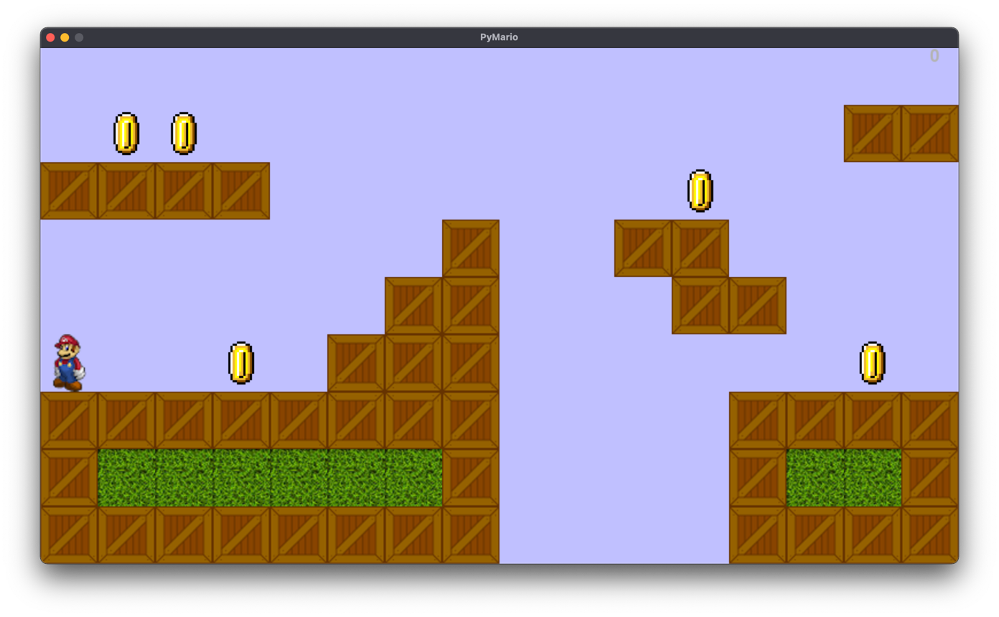
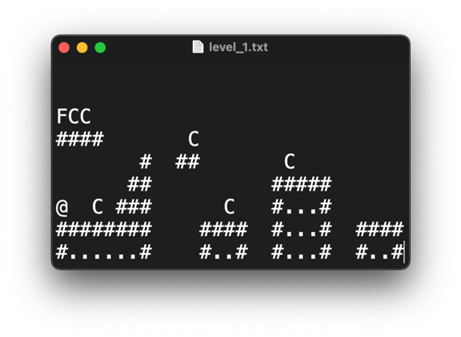

# PyMario
PyGame Yandex Lyceum Project



## Геймплей

* #### В PyMario вы можете создавать собственные уровни с помощью текстовых файлов
* #### Управление производится с помощью стрелок на клавиатуре
* #### На экране отображается текущий счёт, который так же сохраняется при переходе на следующий уровень


## Создание собственных уровней

* #### Игра поддерживает создание новых уровней, для этого необходимо открыть текстовый файл, внести туда нужную разметку и сохранить как “level_<номер уровня>.txt”
* #### Пробел интерпретируется как пустой блок, '#' как ящик, '.' как блок травы и так далее



## Библиотеки
* #### pygame
* #### PyQt6

## Использование
```shell
git clone https://github.com/AYLMS/PyMario.git
pip3 install -r requirements.txt
python3 main.py
```

## Авторы

* #### [Ocelot31](https://github.com/Ocelot31)
* #### [lavender](https://github.com/fast-geek)
* #### [Mickey](https://github.com/krpff)